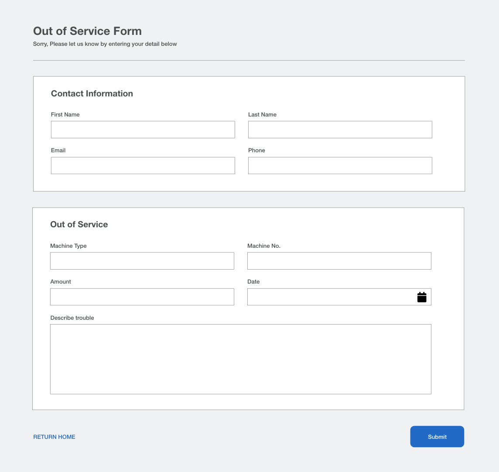
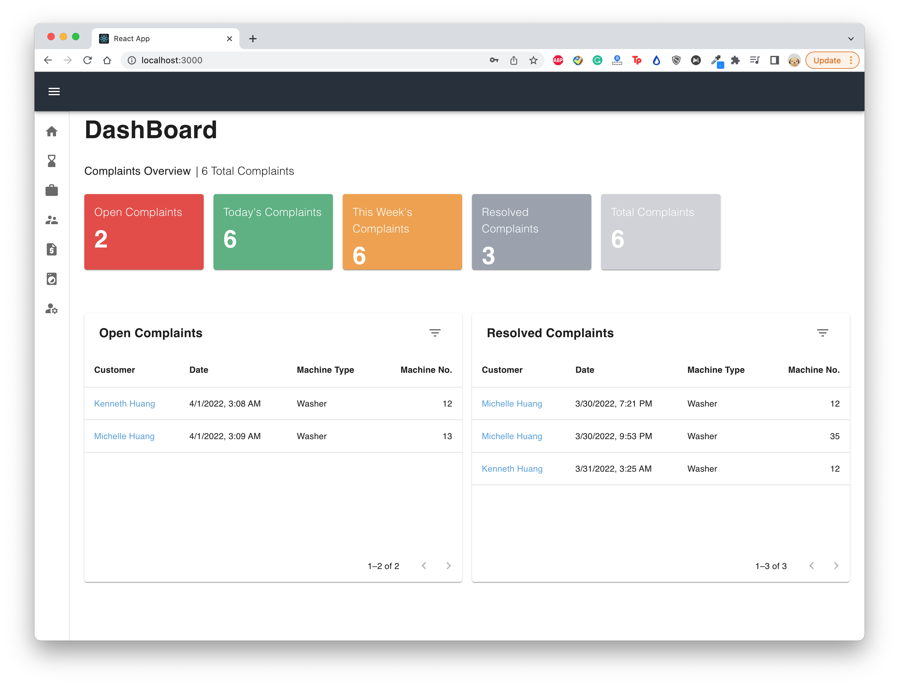
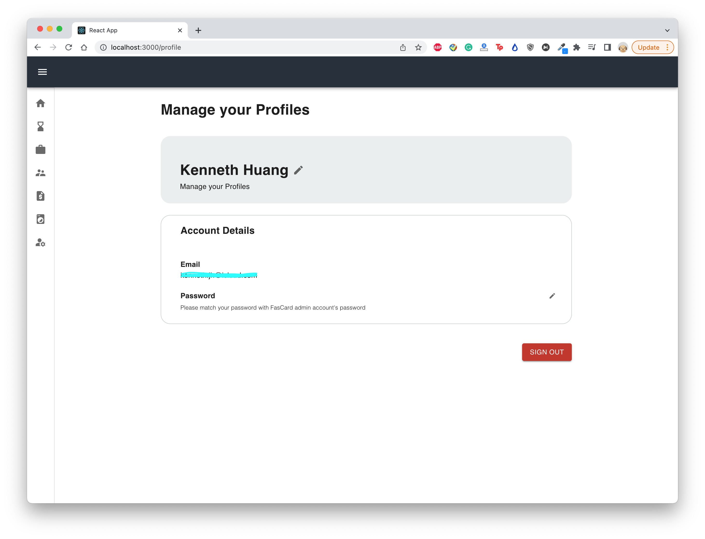
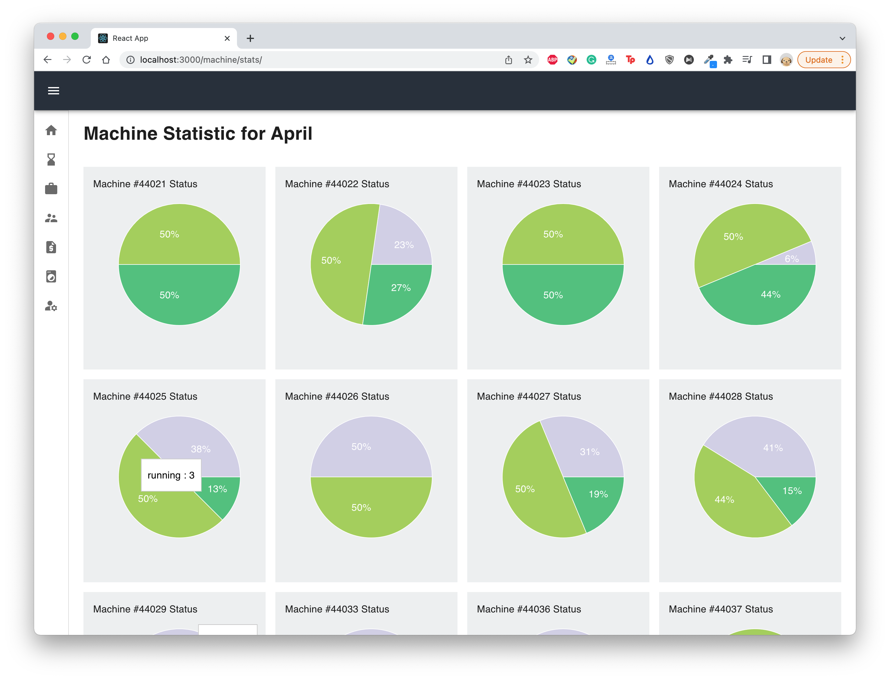
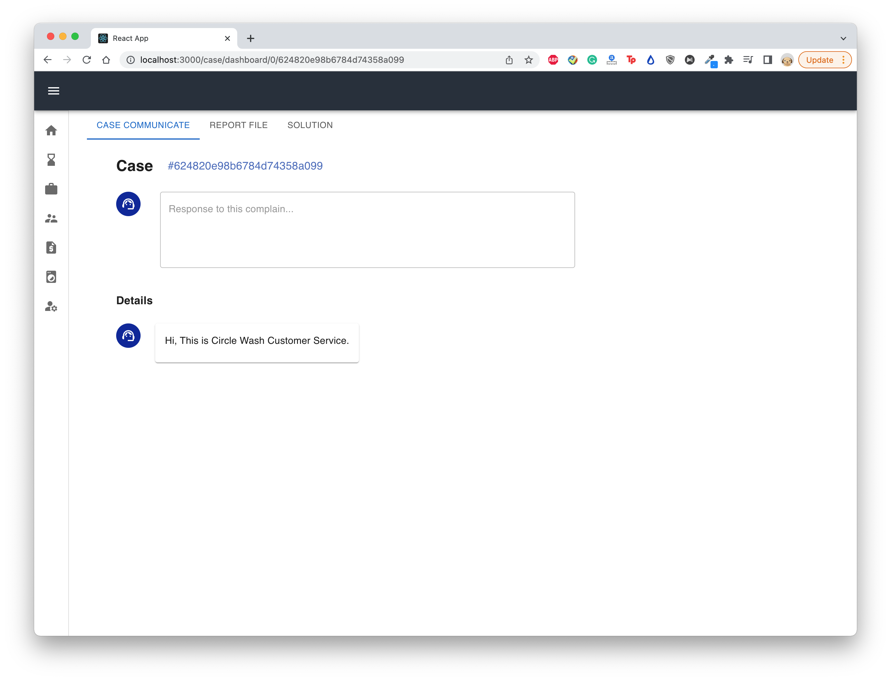
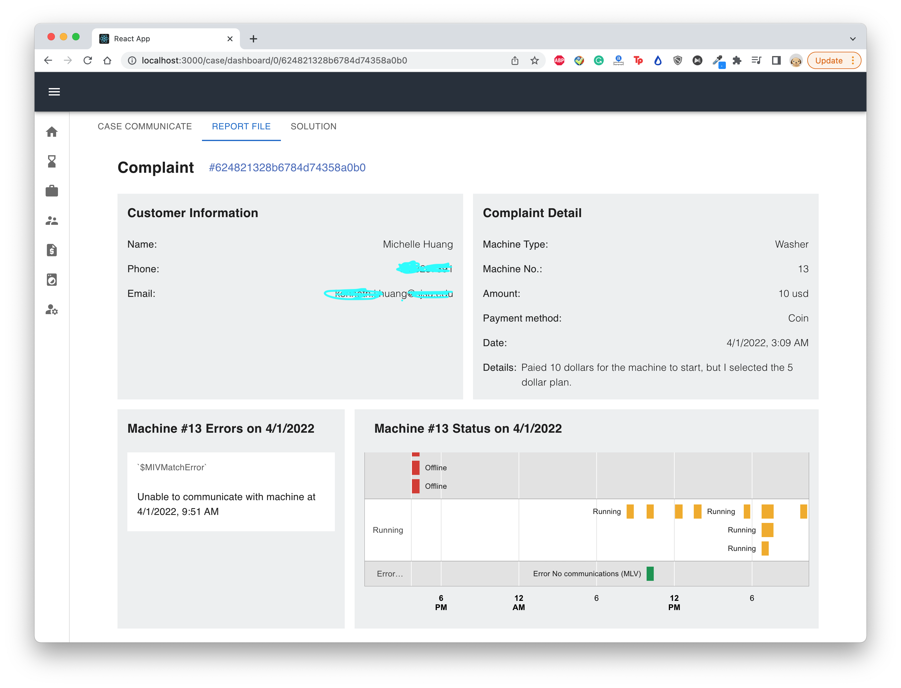
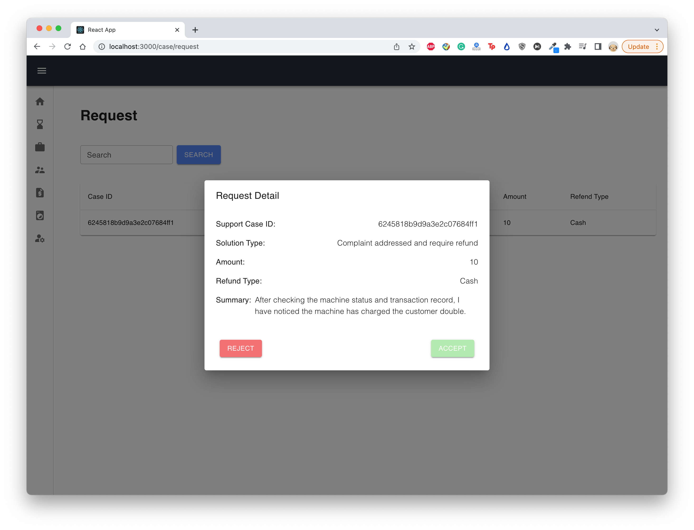
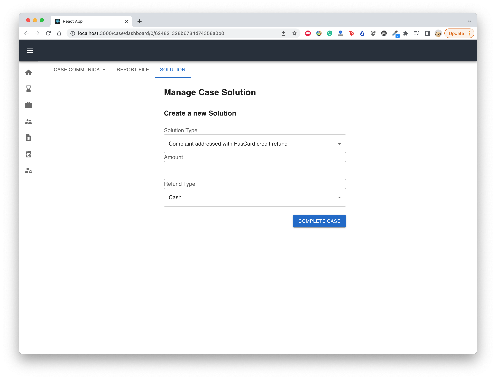

<h1 align="center">Circle Wash Laundromat Website Repository</h1>

[What Is It](#what-is-it)

[How To Use](#how-to-use)

[Dependencies](#dependencies)

[Purpose](#purpose)  

[Collaborators](#collaborators)  

[Contact](#contact)

# What Is It
In this project, I designed a n-tier architecture web application for Circle Wash laundromat. First, based on online reviews, customers have trouble filing complaints after business hours and experience difficulty getting a refund for machine malfunction. The website will provide online customer service handling customers' complaints. 

**Who is the target audience?**
- Laundromat Customer
- Laundromat Staff
- Laundromat Owner
- Laundromat Staff Approver

## Screenshot - Program GUI

**Complaint Form UI**

**Administrative Portal Dashboard**

**Administrative Portal Profile page**

**All Machine Status Analyzation Page**

**Customer Support Chat Page**

**Complaint Details Page**

**Complaint Request Page**

**Complaint Resolve Page**

## UML Diagram

**System Diagram**

**Message Queue**

In my design, all microservice will share the same exchange, CUSTOMER_SUPPORT, with type direct. 

Each consumer microservice will create its own queue with a different binding key that will accept different types of messages or tasks from the exchange.

Each producer microservice will publish its messages or task with a specified binding key to the exchange waiting for other services to handle it.

The image below is my design for the Rabbitmq I am currently using. Circle shapes represent a service, rectangle shapes represent a queue and the triangle represents the exchange that accepts all message and transfers it to a specific queue. 

# How to use
The following steps demenstrate how to run the project locally. 

1. git clone https://github.com/iamkennethhuang/CircleWash-MicroService.git
2. create sendgrid account and link it to a domain name
3. create mongo database on mongodb atlas
4. create a FasCard account with an admin role
5. create rabbitmq cloud account
6. cd backend and add all the environment variable in each file. The environment variables are specified below for each services.
7. cd into each service folder in backend
8. npm build and npm start
9. cd into circlewash folder
10. npm build and npm start
11. cd into circlewashstaff folder
12. npm build and npm start

**Environment Variable For Each Services**
- chat
    - PORT
    - APP_SECRET
    - ATLAS_URL
    - SENDGRID_API_KEY
    - CARE_EMAIL
    - MESSAGE_BROKER_URL
- customer 
    - PORT
    - APP_SECRET
    - ATLAS_URL
- employee
    - PORT
    - APP_SECRET
    - ATLAS_URL
    - CRYPTR_KEY
    - MESSAGE_BROKER_URL
- machine
    - PORT
    - APP_SECRET
    - ATLAS_URL
    - FASCARD_USERNAME
    - FASCARD_PASSWORD
    - MESSAGE_BROKER_URL
- notification
    - PORT
    - APP_SECRET
    - ATLAS_URL
    - SENDGRID_API_KEY
    - CARE_EMAIL
    - MESSAGE_BROKER_URL
- support case
    - PORT
    - APP_SECRET
    - ATLAS_URL
    - MESSAGE_BROKER_URL

# Dependencies

- MongoDB Database Service
- SendGrid (Email Delivery Service)
- Rabbitmq (Message Broker)
- FasCard Admin Account (API)
- NPM installed on the running machine

# Purpose

Circle Wash Website was created to serve two purpose:
1. Documenting my learning process on web development.
2. Provide a local laundromat with a website that have customer support features and machine analyzation feature.

# Collaborators

Developer - Kenneth Huang
Design - Kenneth Huang

# Contact

You can contact Kenneth Huang through email: kenneth.jh@icloud.com

