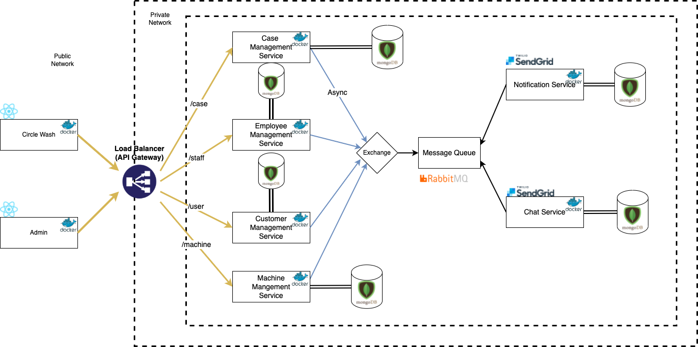

# Introduction
In this project, I will design a n-tier architecture web application for Circle Wash laundromat to increase customer loyalty, internal business productivity, and the operation's credibility. First, based on online reviews, customers have trouble filing complaints after business hours and experience difficulty getting a refund for machine malfunction. The website will provide fair online customer service handling customers' complaints. Increase internal business productivity; the website would offer scheduling services for picking up and dropping off laundries, eliminating staff picking up calls, and manually scheduling each laundry delivery. In addition, the scheduling service would provide an optimal delivery route for the driver to increase productivity. Lastly, the operation's policies and information are currently present to customers in posters scattered around the laundromat. A website can unify the details and communicate information clearly to the customers.

# System Design
I am planning to create an N-tier architecture web application (microservice). In the following section, I will demonstrate the steps for designing and modeling the infrastructure of the circle wash and admin application. Strategy used for modeling microservice is domain-driven design.

## Analyze domain
The diagram below is an analysis of the business domain. The diagram analysis diagram is designed with loosely coupling and high functional cohesion in mind, so new features in the future can be easily be integrated (aka delivery).

- Laundry Cleaning is at the center of the diagram because it’s the core service that Circle Wash is providing. 
- Machine Management provides status analysis and error analysis on the machines.
- FasCard is the payment system for the laundromat.
- Support is a subdomain of laundry cleaning, where it provides customer support for machine malfunctions. It might provide more service in the future.
- Employee system manages role and permission on laundromat employee accounts.

## Bounded Context
The diagram above shows a general relationship between each domain. But a system that has various functions, the relationship between each domain may differ. So creating multiple models representing the same real-world entity in different contexts. So bounded Context diagram can help identify boundaries within one big domain. In the diagram below, I grouped functionality that will share a single domain model into a dotted line circle.

Bounded context isn’t isolated from each other. They are connected with a solid line that defines their relationship with each other. 
- Support boundary depends on customer and employee to get information about the employees and customers. And, it depends on machine management to get machine analysis data on each support case. Finally, it depends on LaundryCleaning/FasCard to retrieve payment data (if there is any). 
- Machine Management depends on FasCard to get all the machine data for analysis.
- FasCard depends on LaundryCleaning to record all laundromat data (machine status, transaction…)

## Define entities, aggregates, and services
**Scenarios:**
- A customer can begin laundry cleaning with a credit card, coins, or FasCard laundry card.
- When a laundry machine fails, customers can create a support case by submitting an online form. 
- When a customer creates a support case, the system sends notifications to employees, the system gathers machine information, transaction information based on support information.
- When the employee access the admin portal, they are provided with all the support cases analytics.
- Employees can each support case in each individual case page on the admin website.
- Employees are able to communicate with customers through individual case pages on the admin website.
- Customers get email notifications when employees are communicating when through the admin website.
- Customers can reply to the email, and the system will record the customer’s email reply and show the message on the admin website.
- Employees can view machine analysis related to each support case on each individual case page.
- Employees can resolve a support page by providing notes and solutions.
- Customer is notified when their case is resolved.

**Entities:**
- Case
- Customer
- Employee
- Machine
- Machine Status
- Notification
- Chat
- Solution
Case, Customer, Employee, Machine, and Chat are all aggregates that represent transactional consistency boundaries. Machine Status is child entities of Machine. Notification and Solution are child entities of the Case.

**Domain Events:**
- Case Status

**Domain Service:**
- n/a

The diagram above demonstrate entities, domain event, and domain service for Support bounded context.

## Identify Microservice
In this section, we will derive microservice from the domain model that we have previously defined. 

From the previous section, we have identified four aggregations, customer, machine, case, chat, and employee. According to DDD design aggregation is a good candidate for a service because it exhibits many characteristics of a well-designed microservice. 

Considering many other services might need to send notifications to clients or employees, I decided Notification would be an individual service. In the notification service, we can store all the notifications in a database for future review.

## Message Queue

**Technology:** RabbitMq

**Queue:**
- Machine queue
- Notification queue
- Employee queue
- Support_case queue

**Producer:**
- Support Case Service
- Employee Service
- Machine Service

**Consumer:**
- Machine Service
- Notification Servicce
- Employee Service
- Support Case Service

**Exchange:**
- CUSTOMER_SUPPORT

In my design, all microservice will share the same exchange, CUSTOMER_SUPPORT, with type direct. 

Each consumer microservice will create its own queue with a different binding key that will accept different types of messages or tasks from the exchange.

Each producer microservice will publish its messages or task with a specified binding key to the exchange waiting for other services to handle it.

The image below is my design for the Rabbitmq I am currently using. Circle shapes represent a service, rectangle shapes represent a queue and the triangle represents the exchange that accepts all message and transfers it to a specific queue. 

